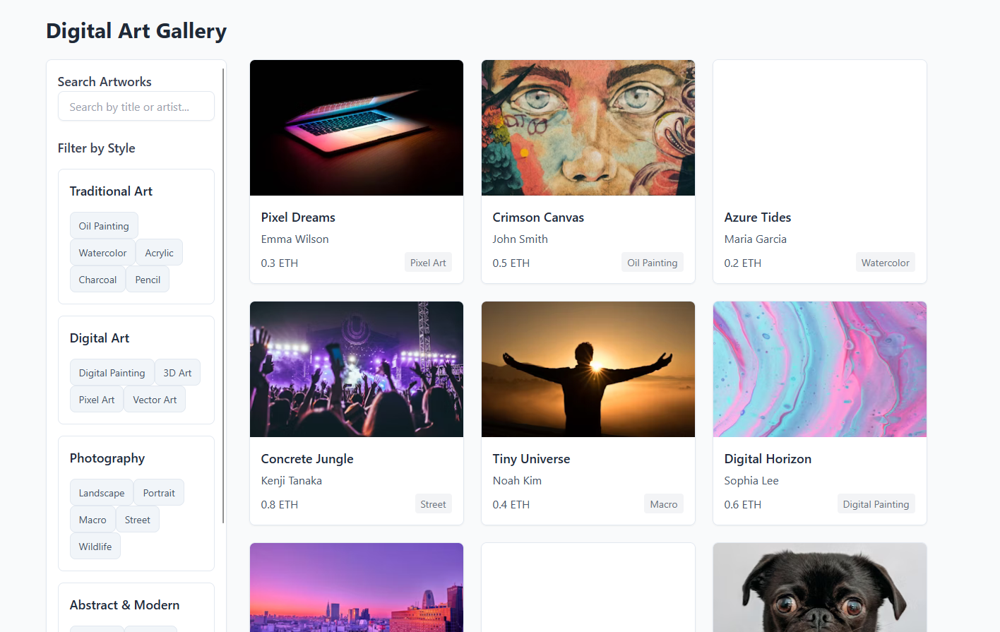
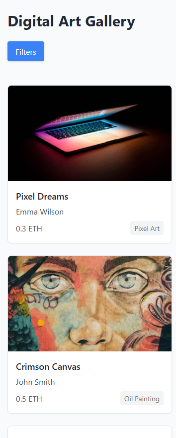

# Digital Art Gallery

[](https://naviandrei.github.io/digital-art-gallery/) 

A responsive, interactive web application showcasing digital artwork with filtering and search capabilities, built with **Tailwind CSS** and **Alpine.js**.

---

## 📱 Gallery Preview

<div align="center">
  
  
  *Desktop View*
</div>

<div align="center">
  
  
  *Mobile View*
</div>

---

## ✨ Features

- **🖼️ Responsive Design**: Optimized for both mobile (off-canvas sidebar) and desktop (sticky sidebar) viewing experiences.
- **🔍 Interactive Filtering**: Filter artworks dynamically by style categories using checkboxes.
- **🔎 Search Functionality**: Instantly search for artworks by title or artist name.
- **🎨 Modern UI**: Clean, accessible interface built with Tailwind CSS utility classes.
- **🚀 Alpine.js Integration**: Lightweight JavaScript framework provides reactivity for search, filtering, and mobile menu toggle without a page reload.
- **📦 Vite Build Tool**: Fast development server and optimized production builds.

## 🛠️ Technologies Used

- **Frontend**:
    - HTML5 / CSS3
    - JavaScript (ES6+)
    - [Alpine.js](https://alpinejs.dev/) v3.x
    - [Tailwind CSS](https://tailwindcss.com/) v3.x
- **Build Tool**:
    - [Vite](https://vitejs.dev/)
- **Code Formatting**:
    - Prettier (via Tailwind plugin)

## 📂 Project Structure

```
Static-Website-Project/
├── dist/                            # Production build output
├── node_modules/                    # Project dependencies
├── public/                          # Static assets (if any)
├── src/
│   ├── css/
│   │   ├── custom.css               # Custom CSS overrides/additions
│   │   └── styles.css               # Main CSS entry point (imports Tailwind)
│   ├── js/
│   │   ├── alpine/
│   │   │   └── galleryComponent.js  # Alpine.js component logic
│   │   ├── main.js                  # Main JS entry point, initializes Alpine
│   └── index.html                   # Main HTML structure
├── .gitignore                       # Git ignore rules
├── index.html                       # Root HTML (redirects/proxies to src/index.html via Vite)
├── package.json                     # Project metadata and dependencies
├── package-lock.json                # Dependency lock file
├── postcss.config.js                # PostCSS configuration (for Tailwind)
├── README.md                        # You are here!
├── tailwind.config.js               # Tailwind CSS configuration
└── vite.config.js                   # Vite configuration
```

## 🚀 Getting Started

### Prerequisites

- Node.js (v16 or later recommended)
- npm (usually comes with Node.js)

### Installation & Setup

1.  **Clone the repository:**
    ```bash
    git clone https://github.com/NaviAndrei/Static-Website-Project.git # Replace with your repo URL
    cd Static-Website-Project
    ```
2.  **Install dependencies:**
    ```bash
    npm install
    ```

### Running the Development Server

1.  **Start the Vite development server:**
    ```bash
    npm run dev
    ```
2.  Open your browser and navigate to the URL provided by Vite (usually `http://localhost:5173`). The server supports Hot Module Replacement (HMR) for fast updates.

### Building for Production

1.  **Build the optimized static assets:**
    ```bash
    npm run build
    ```
2.  The optimized files will be generated in the `dist/` directory. You can deploy the contents of this directory to any static web hosting service.

## 🌐 Live Demo

<!-- Add a link to your deployed application (e.g., GitHub Pages, Netlify, Vercel) -->
**[View Live Demo](https://naviandrei.github.io/digital-art-gallery/)**

## 🙏 Acknowledgements

*   Artwork images sourced from [Unsplash](https://unsplash.com/).
*   Built with guidance from modern web development practices.


## 👤 Author

- **Andrei Ivan (NaviAndrei)**
- GitHub: [@NaviAndrei](https://github.com/NaviAndrei)
- Email: ivan.andrei@syncwithivan.com
